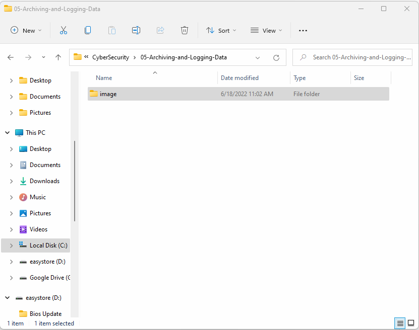

# CyberSecurity

## Week 5 Homework Submission File: Archiving and Logging Data
 
Please edit this file by adding the solution commands on the line below the prompt.
 
Save and submit the completed file for your homework submission.
 
---
 
### Step 1: Create, Extract, Compress, and Manage tar Backup Archives
 
1. Command to **extract** the `TarDocs.tar` archive to the current directory: 
tar xvvf TarDocs.tar
 
 
 
2. Command to **create** the `Javaless_Doc.tar` archive from the `TarDocs/` directory, while excluding the `TarDocs/Documents/Java` directory: 
tar cvvf Javaless_Docs.tar --exclude="TarDocs/Documents/Java" TarDocs/
 
3. Command to ensure `Java/` is not in the new `Javaless_Docs.tar` archive: 
tar tvvf Javaless_Docs.tar | grep -i java
 
 
 
**Bonus** 
- Command to create an incremental archive called `logs_backup.tar.gz` with only changed files to `snapshot.file` for the `/var/log` directory:
 
#### Critical Analysis Question
 
- Why wouldn't you use the options `-x` and `-c` at the same time with `tar`? 
Answer: The ‘-x’ and ‘-c’ modifiers stand for extract and create, respectively, so it would be counterintuitive to use both in the same command.
 
 
---
### Step 2: Create, Manage, and Automate Cron Jobs
 
1. Cron job for backing up the `/var/log/auth.log` file:
0 6  * * 3 sudo tar zcvvf /auth_backup.tgz /var/log/auth.log
 
 
 
 
 
 
### Step 3: Write Basic Bash Scripts
 
1. Brace expansion command to create the four subdirectories: 
mkdir -p ~/backups/{freemem,diskuse,openlist,freedisk}
 
 
 
2. Paste your `system.sh` script edits below:
 
#!/bin/bash
 
# INSTRUCTIONS: Edit the following placeholder command and output filepaths
# For example: cpu_usage_tool > ~/backups/cpuuse/cpu_usage.txt
# The cpu_usage_tool is the command and ~/backups/cpuuse/cpu_usage.txt is the filepath
# In the above example, the `cpu_usage_tool` command will output CPU usage information into a `cpu_usage.txt` file.
# Do not forget to use the -h option for free memory, disk usage, and free disk space
 
# Free memory output to a free_mem.txt file
free -h > ~/backups/freemem/free_mem.txt
 
# Disk usage output to a disk_usage.txt file
du -h > ~/backups/diskuse/disk_usage.txt
 
# List open files to a open_list.txt file
lsof > ~/backups/openlist/open_list.txt
 
# Free disk space to a free_disk.txt file
df -h > ~/backups/freedisk/free_disk.txt
 
 
 
3. Command to make the `system.sh` script executable: 
chmod +x system.sh
 
**Optional**
- Commands to test the script and confirm its execution:
sudo ./system.sh
cat ~/backups/freemem/free_mem.txt
cat ~/backups/diskuse/disk_usage.txt
cat ~/backups/openlist/open_list.txt
cat ~/backups/freedisk/free_disk.txt
 
 
 
**Bonus**
- Command to copy `system` to system-wide cron directory:
 
---
 
### Step 4. Manage Log File Sizes
 
1. Run `sudo nano /etc/logrotate.conf` to edit the `logrotate` configuration file. 
 
    Configure a log rotation scheme that backs up authentication messages to the `/var/log/auth.log`.
 
    - Add your config file edits below:
/var/log/auth.log {
   weekly
   rotate 7
   notifempty
   delaycompression
   missingok
} 
 
 
 
   
---
 
### Bonus: Check for Policy and File Violations
 
1. Command to verify `auditd` is active: 
systemctl status auditd
 
2. Command to set number of retained logs and maximum log file size:
sudo nano /etc/audit/auditd.conf
 
    - Add the edits made to the configuration file below:
max_log_file = 35
num_logs = 7
 
 
 
   
 
3. Command using `auditd` to set rules for `/etc/shadow`, `/etc/passwd` and `/var/log/auth.log`: 
sudo nano /etc/audit/rules.d/audit.rules
 
 
 
 
    - Add the edits made to the `rules` file below:
 
    ##watch
 
-w /etc/shadow -p wra -k hashpass_audit
 
-w /etc/passwd -p wra -k userpass_audit
 
-w /var/log/auth.log -p wra -k authlog_audit
 
 
 
4. Command to restart `auditd`: 
systemctl restart auditd
 
 
 
 
5. Command to list all `auditd` rules: 
sudo auditctl -l
6. Command to produce an audit report: 
sudo aureport -au
 
7. Create a user with `sudo useradd attacker` and produce an audit report that lists account modifications: 
sudo aureport -m
 
 
 
8. Command to use `auditd` to watch `/var/log/cron`: 
sudo auditctl -w /var/log/cron
 
9. Command to verify `auditd` rules: 
sudo auditctl -l
 
 
 
---
 
### Bonus (Research Activity): Perform Various Log Filtering Techniques
 
1. Command to return `journalctl` messages with priorities from emergency to error:
 
1. Command to check the disk usage of the system journal unit since the most recent boot:
 
1. Comand to remove all archived journal files except the most recent two:
 
 
1. Command to filter all log messages with priority levels between zero and two, and save output to `/home/sysadmin/Priority_High.txt`:
 
1. Command to automate the last command in a daily cronjob. Add the edits made to the crontab file below:
 
    ```bash
    [Your solution cron edits here]
    ```
 
---
© 2022 Trilogy Education Services, a 2U, Inc. brand. All Rights Reserved.
 


